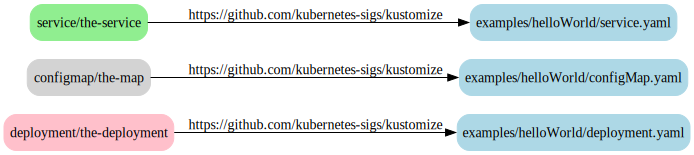
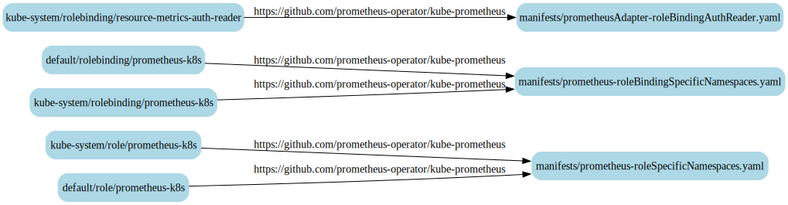
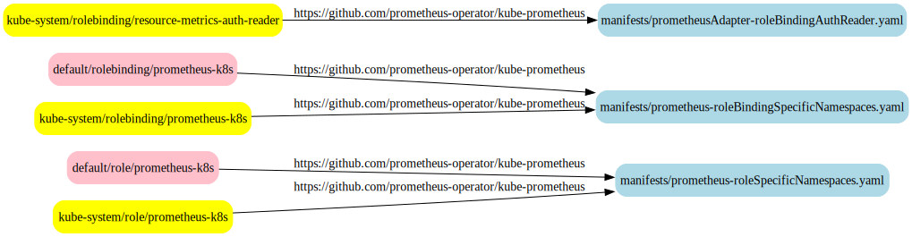
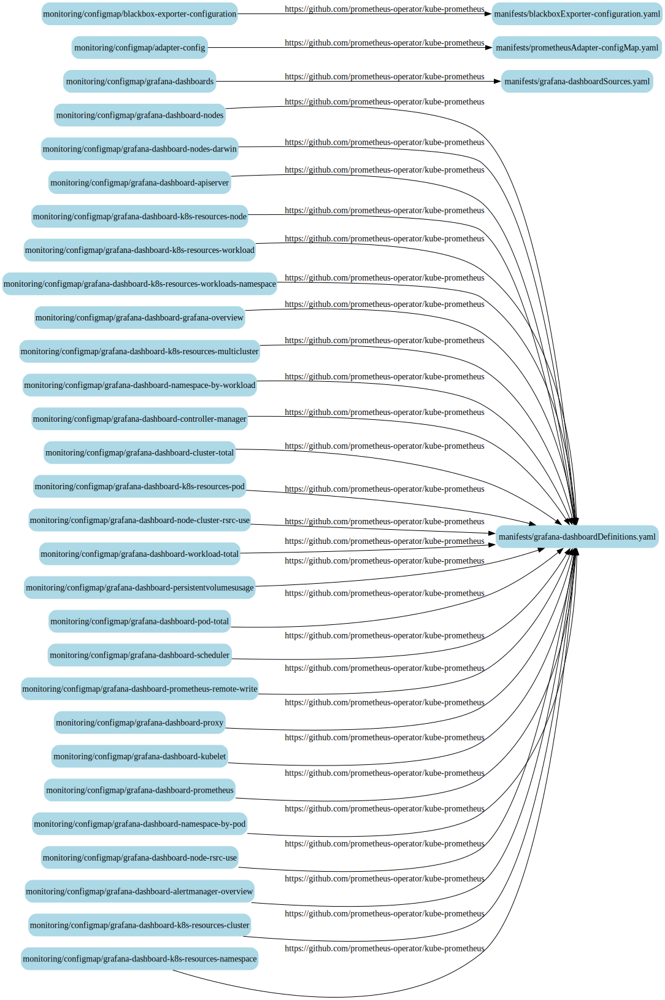
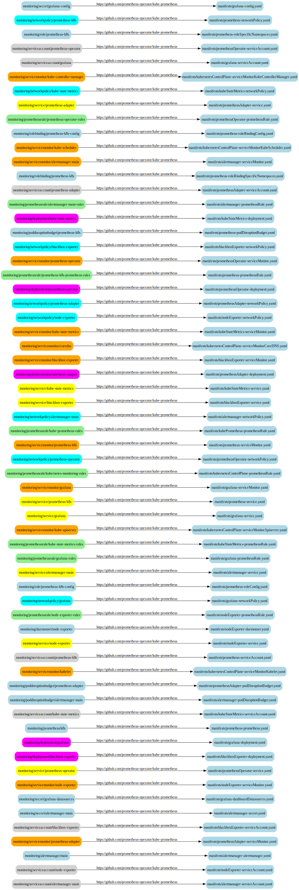

# kustomize-dot

[](https://github.com/dnaeon/kustomize-dot/actions/workflows/test.yaml/badge.svg)
[](https://pkg.go.dev/github.com/dnaeon/kustomize-dot)
[](https://goreportcard.com/report/github.com/dnaeon/kustomize-dot)
[](https://codecov.io/gh/dnaeon/kustomize-dot)

`kustomize-dot` is a CLI and [kustomize](https://kustomize.io/)
[KRM Function plugin](https://github.com/kubernetes-sigs/kustomize/blob/master/cmd/config/docs/api-conventions/functions-spec.md),
which generates a graph of Kubernetes resources and their origin.



# Requirements

* Go version 1.22.x or later
* Docker for local development
* [kustomize](https://kustomize.io/) for building manifests

# Installation

There are multiple ways to install `kustomize-dot`.

In order to build `kustomize-dot` from the latest repo sources execute the
following command.

``` shell
make build
```

If you prefer installing `kustomize-dot` using `go install` execute the
following command instead.

``` shell
go install github.com/dnaeon/kustomize-dot/cmd/kustomize-dot@latest
```

Build a Docker image of `kustomize-dot`.

``` shell
make docker-build
```

# Usage

`kustomize-dot` can operate in two modes - as a standalone CLI application, or
as a
[KRM Function plugin](https://kubectl.docs.kubernetes.io/guides/extending_kustomize/containerized_krm_functions/).

In order to generate a graph of the Kubernetes resources and their origin when
building a kustomization target we need to enable the `originAnnotations` build
option in our `kustomization.yaml` file.

``` yaml
buildMetadata:
  - originAnnotations
```

## CLI

The following section provides some examples on how to use `kustomize-dot` as a
standalone CLI app.

The following example is based on the official
[kustomize helloWorld example](https://github.com/kubernetes-sigs/kustomize/tree/master/examples/helloWorld).

``` yaml
---
apiVersion: kustomize.config.k8s.io/v1beta1
kind: Kustomization
metadata:
  name: hello-world

buildMetadata:
  - originAnnotations

resources:
  - https://github.com/kubernetes-sigs/kustomize//examples/helloWorld/?timeout=120
```

In order to generate the graph we can build the manifests using `kustomize
build`, pipe the resources to `kustomize-dot` for generating the [Dot
representation](https://graphviz.org/doc/info/lang.html), and finally pipe the
result to `dot` for rendering the graph.

The [fixtures package](./pkg/fixtures) contains ready to render resources, which
have already been built using `kustomize build`. The following command will
render the graph for the [kustomize helloWorld
example](https://github.com/kubernetes-sigs/kustomize/tree/master/examples/helloWorld).

``` shell
kustomize-dot generate -f pkg/fixtures/hello-world.yaml | \
    dot -T svg -o graph.svg
```

Or you could execute the following command instead, which will generate the same
graph.

``` shell
kustomize build examples/hello-world | \
    kustomize-dot generate -f - | \
    dot -T svg -o graph.svg
```

The following example builds the graph of resources for
[kube-prometheus operator](https://github.com/prometheus-operator/kube-prometheus).

``` shell
kustomize-dot generate -f pkg/fixtures/kube-prometheus.yaml
```

The [resulting graph is big](./images/kube-prometheus-full.svg) enough to be
confusing.

`kustomize-dot` is flexible and supports filtering of resources, highlighting of
resources or whole namespaces, setting graph layout direction, etc. This is
useful when we want to get a more focused view of the resulting graph.

For example the following graph will _keep_ only resources from the `default`
and `kube-system` namespaces.

``` shell
kustomize-dot generate -f pkg/fixtures/kube-prometheus.yaml \
    --keep-namespace default \
    --keep-namespace kube-system
```

The result looks like this.



We can also highlight the resources from the different namespaces, e.g.

```shell
kustomize-dot generate -f pkg/fixtures/kube-prometheus.yaml \
    --keep-namespace default \
    --keep-namespace kube-system \
    --highlight-namespace default=pink \
    --highlight-namespace kube-system=yellow
```

This is what the graph above looks like when we've applied highlighting to it.



The following example will keep only the `ConfigMap` resources from the
`monitoring` namespace.

```shell
kustomize-dot generate -f pkg/fixtures/kube-prometheus.yaml \
    --keep-namespace monitoring \
    --keep-kind ConfigMap
```

And this is what the graph for the `ConfigMap` resources looks like.



The `--keep-kind`, `--keep-namespace`, `--drop-kind`, `--drop-namespace`,
`--highlight-kind` and `--highlight-namespace` options may be repeated any
number of times, which allows the filters to be applied on many resource kinds
and namespaces.

This example keeps resources from the `monitoring` namespace only, but drops all
`ConfigMap` resources from it, and then highlights various kinds with different
colors.

``` shell
kustomize-dot generate -f pkg/fixtures/kube-prometheus.yaml \
    --keep-namespace monitoring \
    --drop-kind ConfigMap \
    --highlight-kind service=yellow \
    --highlight-kind servicemonitor=orange \
    --highlight-kind serviceaccount=lightgray \
    --highlight-kind deployment=magenta \
    --highlight-kind prometheusrule=lightgreen \
    --highlight-kind networkpolicy=cyan
```

The resulting graph looks like this.



## KRM Function

When `kustomize-dot` is invoked as a [KRM Function
plugin](https://kubectl.docs.kubernetes.io/guides/extending_kustomize/containerized_krm_functions/)
it acts as a transformer in accordance to the [KRM Function
spec](https://github.com/kubernetes-sigs/kustomize/blob/master/cmd/config/docs/api-conventions/functions-spec.md),
which accepts a `ResourceList` as input on `stdin` and outputs a single
`ConfigMap` with the [Dot
representation](https://graphviz.org/doc/info/lang.html) of the resources and
their origin on `stdout`.

The KRM Function supports the same features as the CLI application, allowing the
user to filter out specific resources, set graph layout and highlight resources
and namespaces.

The following is an example configuration for the `kustomize-dot` KRM Function
plugin. You can find this example in the
[examples/kube-prometheus-transformer](./examples/kube-prometheus-transformer)
directory of this repo.

``` yaml
# transformer.yaml
---
apiVersion: dnaeon.github.io/v1
kind: KustomizeDot
metadata:
  name: kustomize-dot
  annotations:
    config.kubernetes.io/function: |
      container:
        image: dnaeon/kustomize-dot:latest
spec:
  # Graph layout direction - TB, BT, LR or RL
  layout: LR

  # Highlight resources of a given kind with the specified color
  highlightKinds:
    Deployment: green
    Service: yellow
    Role: pink

  # Highlight all resources from a given namespace with the specified color
  highlightNamespaces:
    default: orange
    kube-system: pink

  # Drop specified resources from the graph
  dropKinds:
    # - ConfigMap
    # - RoleBinding

  # Drop all resources from the specified namespaces
  dropNamespaces:
    - foo
    - bar

  # Keep the specified resources only and drop anything else
  keepKinds:
    # - baz
    # - qux

  # Keep the resources from the specified namespaces only, and drop anything
  # else.
  keepNamespaces:
    # - monitoring
```

And this is an example kustomization file, which uses our KRM Function plugin as
a transformer.

``` yaml
# kustomization.yaml
---
apiVersion: kustomize.config.k8s.io/v1beta1
kind: Kustomization
metadata:
  name: kube-prometheus

buildMetadata:
  - originAnnotations

resources:
  - https://github.com/prometheus-operator/kube-prometheus//

transformers:
  - transformer.yaml
```

The following command will build the manifests and then pass them to our plugin,
which will generate the Dot representation of the resources. The output will
contain a single `ConfigMap` named `kustomize-dot`, whose data is the actual
`dot` representation of the graph.

``` shell
kustomize build --enable-alpha-plugins examples/kube-prometheus-transformer
```

Or you can pipe the output directly to `dot(1)` and render the graph, e.g.

``` shell
kustomize build --enable-alpha-plugins examples/kube-prometheus-transformer | \
    yq '.data.dot' | \
    dot -Tsvg -o graph.svg
```

# Tests

Run the tests.

``` shell
make test
```

Run test coverage.

``` shell
make test-cover
```

# Contributing

`kustomize-dot` is hosted on
[Github](https://github.com/dnaeon/kustomize-dot). Please contribute by
reporting issues, suggesting features or by sending patches using pull requests.

# License

`kustomize-dot` is Open Source and licensed under the [BSD
License](http://opensource.org/licenses/BSD-2-Clause).
