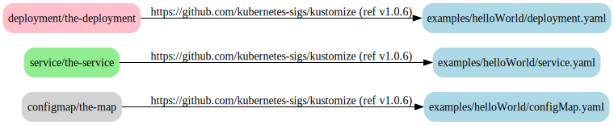

# kustomize-dot

[](https://github.com/dnaeon/kustomize-dot/actions/workflows/test.yaml/badge.svg)
[](https://pkg.go.dev/github.com/dnaeon/kustomize-dot)
[](https://goreportcard.com/report/github.com/dnaeon/kustomize-dot)
[](https://codecov.io/gh/dnaeon/kustomize-dot)

`kustomize-dot` is a CLI and [kustomize](https://kustomize.io/)
[KRM Function plugin](https://github.com/kubernetes-sigs/kustomize/blob/master/cmd/config/docs/api-conventions/functions-spec.md),
which generates a graph of Kubernetes resources and their origin.



## Requirements

* Go version 1.22.x or later
* Docker for local development
* [kustomize](https://kustomize.io/) for building manifests

## Installation

There are multiple ways to install `kustomize-dot`.

In order to build `kustomize-dot` from the latest repo sources execute the
following command.

``` shell
make build
```

If you prefer installing `kustomize-dot` using `go install` execute the
following command instead.

``` shell
go install github.com/dnaeon/kustomize-dot/cmd/kustomize-dot@latest
```

Build a Docker image of `kustomize-dot`.

``` shell
make docker-build
```

## Usage

In order to generate a graph of the Kubernetes resources and their origin when
building a kustomization target we need to enable the `originAnnotations` build
option in our `kustomization.yaml` file.

The following example is based on the official
[kustomize helloWorld example](https://github.com/kubernetes-sigs/kustomize/tree/master/examples/helloWorld).

``` yaml
---
apiVersion: kustomize.config.k8s.io/v1beta1
kind: Kustomization
metadata:
  name: hello-world

buildMetadata:
  - originAnnotations

resources:
  - https://github.com/kubernetes-sigs/kustomize//examples/helloWorld/?timeout=120
```

In order to generate the graph we can build the manifests using `kustomize
build`, pipe the resources to `kustomize-dot` for generating the [Dot
representation](https://graphviz.org/doc/info/lang.html), and finally pipe the
result to `dot` for rendering the graph, e.g.

The [examples directory](./examples) contains ready to render resources, which
have already been built using `kustomize build`. The following command will
render the graph for the [kustomize helloWorld
example](https://github.com/kubernetes-sigs/kustomize/tree/master/examples/helloWorld).

``` shell
kustomize-dot generate -f examples/resources/hello-world.yaml | \
    dot -T svg -o graph.svg
```

Or you could execute the following command instead, which will generate the same
graph.

``` shell
kustomize build examples/kustomizations/hello-world | \
    kustomize-dot generate -f - | \
    dot -T svg -o graph.svg
```

The following example builds the graph of resources for
[kube-prometheus operator](https://github.com/prometheus-operator/kube-prometheus)

``` shell
kustomize-dot generate -f examples/resources/kube-prometheus.yaml
```

The [resulting graph is big](./images/kube-prometheus-full.svg) enough to be
confusing.

`kustomize-dot` is flexible and supports filtering of resources, highlighting of
resources or whole namespaces, setting graph layout direction, etc. This is
useful when we want to get a more focused view of the resulting graph. For
example the following graph will _keep_ only resources from the `default` and
`kube-system` namespaces.

``` shell
kustomize-dot generate -f examples/resources/kube-prometheus.yaml \
    --keep-namespace default \
    --keep-namespace kube-system
```

The result looks like this.


We can also highlight the resources from the different namespaces, e.g.

```shell
kustomize-dot generate -f examples/resources/kube-prometheus.yaml \
    --keep-namespace default \
    --keep-namespace kube-system \
    --highlight-namespace default=pink \
    --highlight-namespace kube-system=yellow
```

This is what the graph above looks like when we've applied highlighting to it.


The following example will keep only the `ConfigMap` resources from the
`monitoring` namespace.

```shell
kustomize-dot generate -f examples/resources/kube-prometheus.yaml \
    --keep-namespace monitoring \
    --keep-kind ConfigMap
```

And this is what the graph for the `ConfigMap` resources looks like.


The `--keep-kind`, `--keep-namespace`, `--drop-kind`, `--drop-namespace`,
`--highlight-kind` and `--highlight-namespace` options may be repeated any
number of times, which allows the filters to be applied on many resources kinds
and namespaces.

This example keeps resources from the `monitoring` namespace only, but drops all
`ConfigMap` resources from it, and then highlights various kinds with different
colors.

``` shell
kustomize-dot generate -f examples/resources/kube-prometheus.yaml \
    --keep-namespace monitoring \
    --drop-kind ConfigMap \
    --highlight-kind service=yellow \
    --highlight-kind servicemonitor=orange \
    --highlight-kind serviceaccount=lightgray \
    --highlight-kind deployment=magenta \
    --highlight-kind prometheusrule=lightgreen \
    --highlight-kind networkpolicy=cyan
```

The resulting graph looks like this.


TODO: Add usage as KRM Function plugin

## Tests

Run the tests.

``` shell
make test
```

Run test coverage.

``` shell
make test-cover
```

## Contributing

`kustomize-dot` is hosted on
[Github](https://github.com/dnaeon/kustomize-dot). Please contribute by
reporting issues, suggesting features or by sending patches using pull requests.

## License

`kustomize-dot` is Open Source and licensed under the [BSD
License](http://opensource.org/licenses/BSD-2-Clause).
